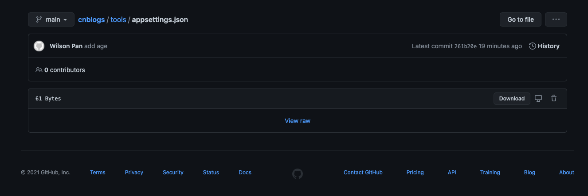
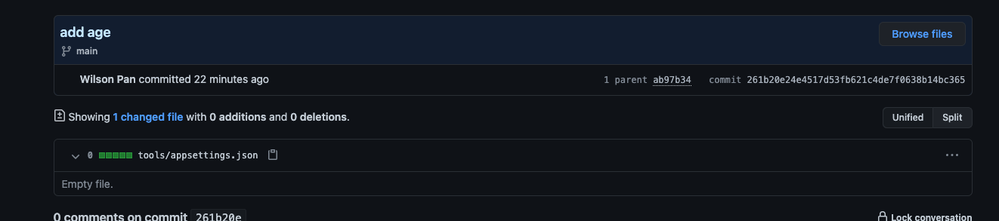
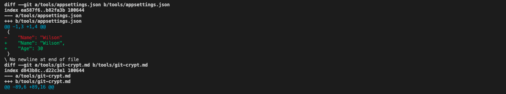

# 保护Git仓库敏感信息

代码中无可避免有一些敏感信息，包含但不限于，数据库信息，密钥，账号信息等等。通常我们会把这些信息放在配置文件，这些信息若泄露会造成安全问题。

以前我们做法，是把配置文件通过`.gitignore`排除配置文件，但是这些配置文件通常经常变动，没有一个地方统一维护，靠线下互相传，效率低下不说，也没法维护。

**那能不能既方便又安全管理敏感信息？**答案当然是有，不然就没今天这篇文章

下面就介绍如何利用[git-crypt](https://github.com/AGWA/git-crypt/)达到想要的效果

## 安装

- Mac OS X

    ```bash
    brew install git-crypt
    brew install gpg
    ```

- Linux

    ```bash
    make && make install PREFIX=/usr/local
    ```

- Windows

    1. [下载git-crypt.exe](https://github.com/oholovko/git-crypt-windows/releases)
    2. 放在Path目录/添加Path目录

> 此方法为未尝试

## 使用

### 方法一（不依赖GPG）

1. 初始化仓库

    ```bash
    git-crypt init
    ```

2. 创建`.gitattributes`文件并编辑指定的加密文件

    ```bash
    touch .gitattributes    

    vi .gitattributes
    ```

    格式如下

    ```text
    appsettings.json filter=git-crypt diff=git-crypt
    *.key filter=git-crypt diff=git-crypt
    config/**.json filter=git-crypt diff=git-crypt
    ```

3. 上传代码

    ```bash
    git add . && git commit -m 'git crypt'

    git push
    ```

4. 导出密钥

    ```bash
    git-crypt export-key /Users/wilsonpan/wilson.pan/keys/git-crypt-key
    ```

5. 解密（第一次克隆之后）

    ```bash
    git-crypt unlock /Users/wilsonpan/wilson.pan/keys/git-crypt-key
    ```

### 方法二（使用GPG）

1. 初始化仓库

    ```bash
    git-crypt init
    ```

2. 创建`.gitattributes`文件并编辑指定的加密文件

    ```bash
    touch .gitattributes    

    vi .gitattributes
    ```

    格式如下

    ```text
    appsettings.json filter=git-crypt diff=git-crypt
    *.key filter=git-crypt diff=git-crypt
    config/**.json filter=git-crypt diff=git-crypt
    ```

3. 生成密钥

    ```bash
    gpg --gen-key # 按提示输入相关信息, name, email
    ```

4. 配置git-crypt

    ```bash
    git-crypt add-gpg-user <USER_ID>  # <USER_ID>填入上面输入的名称/key，不然会报错
    ```

5. 上传代码

    ```bash
    git add . && git commit -m 'git crypt'

    git push
    ```

6. 导出GPG密钥

    ```bash
    gpg --output git-crypt.pgp --armor --export-secret-key <USER_ID>  # 步骤二生成
    ```

7. 导入GPG密钥(团队成员)

    ```bash
    gpg --import git-crypt.pgp
    ```

8. 解密

    ```bash
    git-crypt unlock
    ```

两个方法都是使用公钥私钥非对称加密，只要私钥不泄露，安全性都是一样，但是方式二可以设置密码保护私钥，防篡改，方式二比方式一安全性又高一点

方式二需要用到GPG，步骤也多一点，安全就是要牺牲一点便利性。

当上面加密步骤操作完，本地操作是无感知，服务器上文件是加密的二进制文件，其他成员克隆/更新需要使用`git-crypt unlock`解密，只需要操作一次，以后都是正常提交推送即可

服务器上看是这样





本地日志是不受影响



## 引用

[git-crypt](https://github.com/AGWA/git-crypt/)

[git-crypt-windows](https://github.com/oholovko/git-crypt-windows)

[Github - MD](https://github.com/WilsonPan/cnblogs/blob/main/tools/git-crypt.md)
